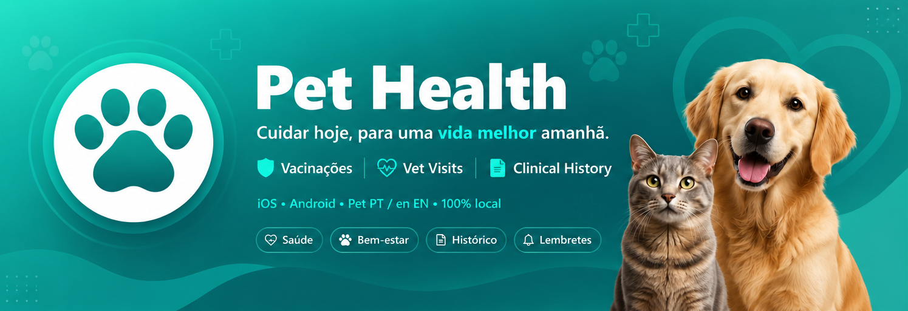

<p align="center">
  
</p>

<p align="center">
  <a href="https://flutter.dev"></a>
  <a href="https://dart.dev"></a>
  
  <a href="LICENSE"></a>
</p>

<p align="center">
  <strong>A cross-platform app to manage your pets' health, vaccinations and wellbeing.</strong><br/>
  Single Flutter codebase · iOS & Android · 🇵🇹 Portuguese / 🇬🇧 English · 100% local data
</p>

---

## 📋 Table of contents

- [Overview](#-overview)
- [Features](#-features)
- [Tech stack](#-tech-stack)
- [Documentation](#-documentation)
- [Getting started](#-getting-started)
- [Project structure](#-project-structure)
- [Localization](#-localization)
- [Roadmap](#-roadmap)
- [Contributing](#-contributing)
- [License](#-license)

---

## 🌟 Overview

**Pet Health** is a Flutter app that helps pet owners stay on top of vaccinations, deworming, vet visits and other health events for their dogs, cats, and any other animal companion. All data is stored **locally** on the device — no servers, no accounts, no tracking.

The same codebase compiles to both iOS and Android with Material 3 UI on each platform.

## ✨ Features

| Area | Description |
|------|-------------|
| 🐾 **8 species + custom** | Dogs, cats, birds, rabbits, hamsters, fish, reptiles — or anything else via the "Other" option with a free-text name |
| 💉 **Health records** | Log vaccines, deworming, consultations, surgeries, exams and other events with notes and future due dates |
| 📒 **Caderneta** | Microchip, insurance, veterinarian contact, weight, sterilization status, allergies and medical conditions |
| 🔔 **Smart reminders** | Local notifications fired **3 days before** and **on the due date** of every upcoming treatment |
| 📊 **Status indicators** | See at a glance what's overdue, due within 7 days, or scheduled further out |
| 📈 **Per-pet stats** | Summary of vaccines, deworming events and pending alerts for each pet |
| 🪦 **Lifecycle** | Mark pets as deceased (with date) or archived — they're hidden by default but always accessible |
| 🎂 **Auto-calculated age** | Pet age computed automatically in days / months / years |
| 🌍 **Bilingual UI** | Portuguese (default) and English, switchable at runtime from the Settings tab |
| 🌓 **Light & dark mode** | Follows the system theme |

## 🛠 Tech stack

- **[Flutter 3.19+](https://flutter.dev)** — cross-platform UI framework
- **[Dart 3.3+](https://dart.dev)** — primary language
- **[Hive](https://pub.dev/packages/hive)** — fast, lightweight local NoSQL persistence
- **[flutter_local_notifications](https://pub.dev/packages/flutter_local_notifications)** — scheduled notifications on iOS and Android
- **[Provider](https://pub.dev/packages/provider)** — state management for locale changes
- **[shared_preferences](https://pub.dev/packages/shared_preferences)** — persisted user preferences
- **Material 3** — modern adaptive UI

> 💡 **Zero external dependencies on backend services.** Everything runs offline.

## 📚 Documentation

| File | What's in it |
|---|---|
| [`README.md`](README.md) | This page — high-level overview |
| [`ROADMAP.md`](ROADMAP.md) | What's shipped, what's next, what's in the backlog |
| [`docs/ARCHITECTURE.md`](docs/ARCHITECTURE.md) | Layered architecture, sequence diagrams, design decisions |
| [`docs/DATABASE.md`](docs/DATABASE.md) | Hive schema, ER diagram, type adapters, migration strategy |
| [`CLAUDE.md`](CLAUDE.md) | Conventions guide for AI agents working in this repo |

## 🚀 Getting started

### 1. Install Flutter

Follow the official guide: [docs.flutter.dev/get-started/install](https://docs.flutter.dev/get-started/install).

### 2. Clone and bootstrap

```bash
git clone https://github.com/<your-username>/pet-health-app.git
cd pet-health-app

# Generate the platform folders (ios/ and android/) — they are not committed
flutter create . --org com.celiagoncalves --platforms ios,android

# Install dependencies and regenerate AppLocalizations
flutter pub get
```

### 3. Run

```bash
# Android (works on Windows / macOS / Linux)
flutter run -d android

# iOS (macOS only)
flutter run -d ios

# Pick a device interactively
flutter run
```

### 4. Build for release

```bash
flutter build apk --release           # Android APK
flutter build appbundle --release     # Android App Bundle (Play Store)
flutter build ios --release           # iOS (macOS only)
```

> ⚠️ **Windows can build Android.** Building iOS requires **macOS + Xcode** — or a CI runner like Codemagic / GitHub Actions with a macOS image.

## 🗂 Project structure

```
pet-health-app/
├── assets/
│   ├── logo.svg                        # App icon (source — convert to PNG for launcher)
│   └── banner.png                      # README banner
├── docs/
│   ├── ARCHITECTURE.md                 # Technical architecture + diagrams
│   └── DATABASE.md                     # Data model + ER diagram
├── lib/
│   ├── main.dart                       # App entry point + MaterialApp setup
│   ├── l10n/
│   │   ├── app_pt.arb                  # Portuguese strings (default)
│   │   └── app_en.arb                  # English strings
│   ├── models/                         # Pet, HealthRecord, enums + hand-written Hive adapters
│   ├── services/                       # database / notifications / locale singletons
│   ├── screens/                        # one folder per feature (pets, health, alerts, settings)
│   └── widgets/                        # small reusable UI bits
├── pubspec.yaml
├── analysis_options.yaml
├── l10n.yaml
├── ROADMAP.md
├── CLAUDE.md
├── LICENSE
└── README.md
```

See [docs/ARCHITECTURE.md](docs/ARCHITECTURE.md) for the full layer breakdown with diagrams.

## 🌍 Localization

The app uses Flutter's official `intl` + `flutter_localizations` setup with `.arb` files.

- 🇵🇹 **Portuguese (pt)** — default, template file
- 🇬🇧 **English (en)**

Strings live in [`lib/l10n/app_pt.arb`](lib/l10n/app_pt.arb) and [`lib/l10n/app_en.arb`](lib/l10n/app_en.arb). The `AppLocalizations` class is auto-generated by `flutter pub get` (config: [`l10n.yaml`](l10n.yaml)).

Language can be changed at runtime from the **Settings tab**. The choice is persisted via `shared_preferences` under the key `appLanguage`.

To add a new language, copy `app_pt.arb` to `app_<code>.arb`, translate the values, and register the locale in [`lib/services/locale_service.dart`](lib/services/locale_service.dart).

## 🗺 Roadmap

The full plan with phases lives in [ROADMAP.md](ROADMAP.md). Highlights of what's coming next:

- 📸 **Phase 2** — Pet photos & photo diary
- 📝 **Phase 3** — Notes / behavioral journal
- 📅 **Phase 4** — Calendar with birthdays & alerts
- 🔎 **Phase 5** — Breed autocomplete (curated PT + EN list)

## 🤝 Contributing

Contributions are welcome! Before opening a PR, please skim [CLAUDE.md](CLAUDE.md) for the project conventions (the most important: **no hardcoded user strings**, **stay in Dart**, **no `build_runner`**).

1. Fork the repository
2. Create a feature branch (`git checkout -b feature/my-feature`)
3. Commit your changes (`git commit -m 'Add X'`)
4. Push to the branch (`git push origin feature/my-feature`)
5. Open a Pull Request

## 📄 License

This project is licensed under the MIT License — see [LICENSE](LICENSE) for details.

---

<p align="center">Made with ❤️ for our four-legged (and feathered, and scaly) friends</p>
