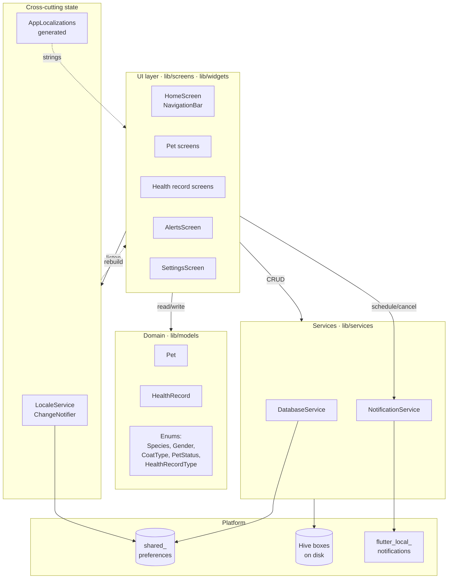
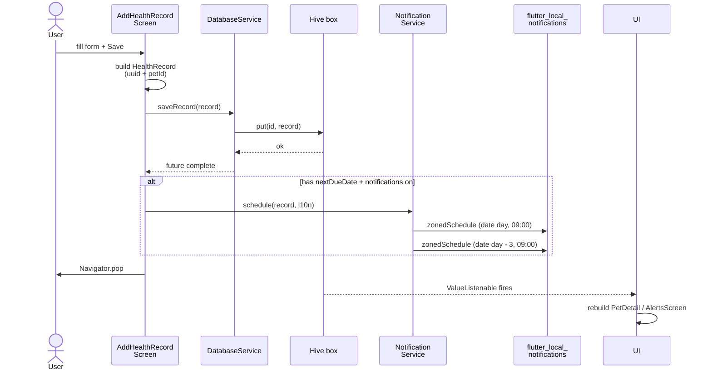
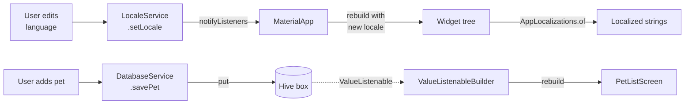

# 🏗 Architecture

Technical overview of how Pet Health is structured. For database details see [DATABASE.md](DATABASE.md); for the feature roadmap see [../ROADMAP.md](../ROADMAP.md).

---

## Guiding principles

1. **Stay native-only-Flutter.** No platform-specific Kotlin/Swift code.
2. **No premature abstraction.** Direct `setState` and Hive `ValueListenable` over Bloc/Redux/Riverpod.
3. **Zero `build_runner`.** Hive `TypeAdapter`s are hand-written. If we ever add 3+ more complex models, reconsider.
4. **Localization-first.** No hardcoded user-facing strings — everything via `AppLocalizations`.
5. **Local-first data.** All state lives on the device. No accounts, no servers.

## Layered overview



## Data flow — adding a health record with notification



## Module map

| Path | Purpose |
|---|---|
| [`lib/main.dart`](../lib/main.dart) | Async bootstrap: `DatabaseService.init()` → `NotificationService.init()` → `LocaleService.load()` → request permissions → `runApp` wrapped in `ChangeNotifierProvider<LocaleService>` |
| [`lib/models/`](../lib/models/) | Plain Dart classes — `Pet`, `HealthRecord`, all enums. Each enum exposes `label(l)` for localization and any icon/color/section getters needed by the UI |
| [`lib/services/`](../lib/services/) | Singletons: `DatabaseService` (Hive boxes + CRUD), `NotificationService` (scheduling), `LocaleService` (`ChangeNotifier` for language) |
| [`lib/screens/`](../lib/screens/) | One folder per feature: `pets/`, `health/`, `alerts/`, `settings/`. `home_screen.dart` is the root scaffold |
| [`lib/widgets/`](../lib/widgets/) | Small reusable UI bits — `pet_row.dart`, `stat_card.dart`, `health_record_card.dart`, `filter_chip_button.dart` |
| [`lib/l10n/`](../lib/l10n/) | `app_pt.arb` (template) + `app_en.arb`. `app_localizations.dart` is generated by `flutter pub get` (gitignored) |

## Reactivity model



- **Locale changes** flow via `Provider`/`ChangeNotifier` — only the `MaterialApp` rebuilds.
- **Data changes** flow via Hive's native `box.listenable()` — only screens that listen to that box rebuild. No global state needed.

## Notification scheduling

Both notifications use the **same `notificationID` base** (uuid string), with the 3-day reminder appended `_3d`. Integer IDs for `flutter_local_notifications` come from `id.hashCode` — collision risk is vanishingly small.

```
record.id = "abc-1234"
  → main notification id    = "abc-1234".hashCode
  → reminder notification id = "abc-1234_3d".hashCode
```

When a record is deleted/edited, **both** must be cancelled. See `NotificationService.cancel(record)`.

## Localization regeneration

When changing strings:

1. Edit both `lib/l10n/app_pt.arb` **and** `lib/l10n/app_en.arb` (PT is the template per [l10n.yaml](../l10n.yaml))
2. Run `flutter pub get` (triggers `flutter gen-l10n`)
3. New getters appear on `AppLocalizations` automatically
4. Add `.arb` keys for both languages or the build will fail in CI even if PT covers it (English fallback is strict)

## Hive schema versioning

Adding a field to a model = breaking change for the on-disk format. The path we use:

1. Bump `typeId` on the adapter (e.g. `Pet` went `1 → 11` when caderneta fields were added)
2. Bump `_currentSchemaVersion` in `DatabaseService`
3. The init flow detects the mismatch and **wipes both boxes** before opening them

This is acceptable while the app has no real users. Before a real release we'll need a proper migration strategy — see [ROADMAP.md](../ROADMAP.md#backlog).

## Platform-specific notes

### Android
- `minSdkVersion`: 21 (Flutter default)
- `compileSdkVersion`: 36
- **Core library desugaring enabled** (required by `flutter_local_notifications`) — see [`android/app/build.gradle.kts`](../android/app/build.gradle.kts)
- `POST_NOTIFICATIONS` permission requested at runtime on Android 13+

### iOS
- Deployment target: iOS 12
- Notification permission prompt fires once on first launch via `requestPermissions()`
- ⚠️ **Builds require macOS + Xcode** — no Windows path

## Decision log

| Decision | Why |
|---|---|
| Hive over sqflite/drift | Schema is small, no relational joins needed, key-value fits |
| Manual TypeAdapters (no `hive_generator`) | Avoids `build_runner` overhead for ~2 models |
| Provider only for locale | Cross-screen reactivity for language; Hive `ValueListenable` covers data |
| Material 3 on iOS too (no Cupertino) | Single codebase, single visual language. May revisit when there's a real iOS user base |
| No tests yet | Migration was the priority. Will be added before any real release |
