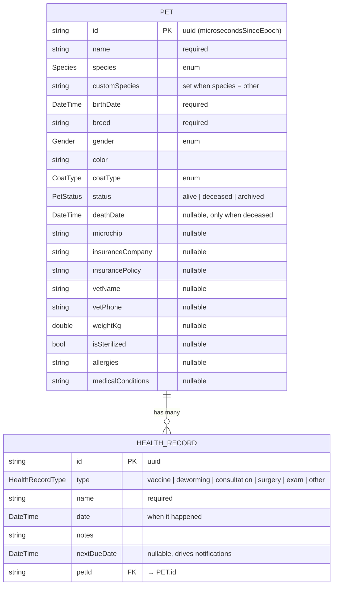
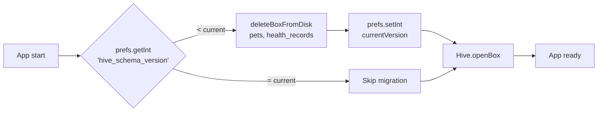

# 🗃 Data model

How Pet Health stores data on disk. For architectural context see [ARCHITECTURE.md](ARCHITECTURE.md).

---

## Storage engine

[**Hive 2.x**](https://docs.hivedb.dev/) — pure-Dart NoSQL key-value store, no native dependencies. Boxes are stored as `.hive` files inside the app's documents directory (managed automatically by `path_provider`).

Two boxes:

| Box | Type | Key | Owns adapter |
|---|---|---|---|
| `pets` | `Box<Pet>` | `pet.id` (string uuid) | `PetAdapter` (typeId **11**) |
| `health_records` | `Box<HealthRecord>` | `record.id` (string uuid) | `HealthRecordAdapter` (typeId **2**) |

> `typeId` values are **burned in** — once removed, never reuse, even if the model disappears.

## Entity-relationship diagram



## Enums

| Enum | Values | Stored as |
|---|---|---|
| `Species` | dog, cat, bird, rabbit, hamster, fish, reptile, other | byte (index) |
| `Gender` | male, female | byte |
| `CoatType` | short, medium, long, curly, hairless | byte |
| `PetStatus` | alive, deceased, archived | byte |
| `HealthRecordType` | vaccine, deworming, consultation, surgery, exam, other | byte |

Enum stability matters: appending values is safe, **reordering is not** — old data deserializes by index.

## TypeAdapter format

Adapters are hand-written (no `build_runner`). The serialization layout for `Pet`:

```
[id:String][name:String][species:Byte]
[customSpecies:String]    ← '' for null
[birthDate:Int millis][breed:String][gender:Byte]
[color:String][coatType:Byte]
[status:Byte]
[hasDeathDate:Bool] [deathDate:Int millis]?
[microchip:String] [insuranceCompany:String] [insurancePolicy:String]
[vetName:String]   [vetPhone:String]
[hasWeight:Bool]  [weightKg:Double]?
[hasSterilized:Bool] [isSterilized:Bool]?
[allergies:String] [medicalConditions:String]
```

For nullable strings: empty string ↔ null. For nullable numerics/bools: a leading bool flag indicates presence.

## Schema versioning



The current version is **2** (set after caderneta fields were added to `Pet`). Bump when any adapter changes incompatibly.

> 📌 This is a **destructive migration**. Acceptable now because there are no real users. Before a production release we'll add a real migration strategy — see [ROADMAP.md](../ROADMAP.md#backlog).

## Reactivity

Each box exposes a `ValueListenable<Box<T>>` via `box.listenable()`. Screens that want to react to data changes:

```dart
ValueListenableBuilder<Box<Pet>>(
  valueListenable: DatabaseService.instance.petsBox.listenable(),
  builder: (context, box, _) {
    final pets = DatabaseService.instance.allPets();
    // ...
  },
)
```

No Provider, no Bloc — Hive's listenable is sufficient for everything except cross-cutting concerns (currently just locale).

## CRUD entry points

All access goes through `DatabaseService.instance`:

| Operation | Method |
|---|---|
| List all pets (sorted by name) | `allPets()` |
| Records for a pet (sorted by date desc) | `recordsFor(petId)` |
| Create / update pet | `savePet(pet)` |
| Delete pet (cascades to records) | `deletePet(pet)` |
| Create / update health record | `saveRecord(record)` |
| Delete health record | `deleteRecord(record)` |

Note: `deletePet` cascades to records but **does not cancel notifications** — that responsibility is in the calling code (currently `PetListScreen._deletePet`).

## Cleanup contract

Always cancel pending notifications **before** deleting a record:

```dart
await NotificationService.instance.cancel(record);
await DatabaseService.instance.deleteRecord(record);
```

For pet deletion, iterate every record first.

## Future migrations (not yet implemented)

Adding fields without wiping data will require:

1. Bump adapter `typeId` to a new value (current next-available: **12** for Pet, **3** for HealthRecord)
2. Write a `migrate()` method that reads with the old adapter, transforms, writes with the new adapter
3. Drop the schema-wipe in `DatabaseService.init()` once we have real users

This is on the backlog — see [ROADMAP.md](../ROADMAP.md).
